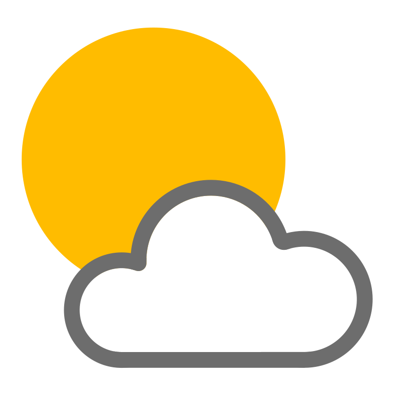

This is a Kotlin Multiplatform project targeting Android, iOS, Desktop (JVM).

* [/composeApp](./composeApp/src) is for code that will be shared across your Compose Multiplatform applications.
  It contains several subfolders:
  - [commonMain](./composeApp/src/commonMain/kotlin) is for code that’s common for all targets.
  - Other folders are for Kotlin code that will be compiled for only the platform indicated in the folder name.
    For example, if you want to use Apple’s CoreCrypto for the iOS part of your Kotlin app,
    the [iosMain](./composeApp/src/iosMain/kotlin) folder would be the right place for such calls.
    Similarly, if you want to edit the Desktop (JVM) specific part, the [jvmMain](./composeApp/src/jvmMain/kotlin)
    folder is the appropriate location.

* [/iosApp](./iosApp/iosApp) contains iOS applications. Even if you’re sharing your UI with Compose Multiplatform,
  you need this entry point for your iOS app. This is also where you should add SwiftUI code for your project.



# WeatherApp

WeatherApp es una aplicación de pronóstico del tiempo que utiliza la API de clima de [WeatherAPI](https://www.weatherapi.com/) para proporcionar información sobre el clima actual y pronósticos para la ubicación del usuario. La aplicación está desarrollada siguiendo los principios de arquitectura MVVM, utilizando Retrofit para realizar solicitudes a la API, implementando Clean Architecture y siguiendo los principios de SOLID. Además, la aplicación almacena los datos en una base de datos local utilizando Room y utiliza el GPS del dispositivo para determinar la ubicación del usuario y mostrar el clima correspondiente.

## Configuración de la API

La API de WeatherAPI requiere una clave de API para su acceso. Asegúrate de agregar tu clave de API en el archivo `app/src/main/res/values/strings.xml` de la siguiente manera:

```xml
<string name="api_key">tu_clave_de_api_aqui</string>
<string name="default_language">tu_lang_aqui</string>
<integer name="default_days">dias_que_quieres_cargar</integer>
```

Reemplaza `"tu_clave_de_api_aqui"` con la clave de API que obtuviste al registrarte en WeatherAPI.
Reemplaza `"tu_lang_aqui"` con el lenguage en que quieres recibir la informacion del API.
Reemplaza `"dias_que_quieres_cargar"` con la cantidad de dias que quieres obtener a partir del dia actual.

## Características

- Muestra el clima actual y el pronóstico para la ubicación del usuario.
- Permite buscar pronósticos para otras ubicaciones.
- Guarda el historial de búsquedas.

## Tecnologías utilizadas

- Kotlin
- Kotlin Multiplatform Architecture Components
- Clean Architecture
- SOLID

### Build and Run Android Application

To build and run the development version of the Android app, use the run configuration from the run widget
in your IDE’s toolbar or build it directly from the terminal:
- on macOS/Linux
  ```shell
  ./gradlew :composeApp:assembleDebug
  ```
- on Windows
  ```shell
  .\gradlew.bat :composeApp:assembleDebug
  ```

### Build and Run Desktop (JVM) Application

To build and run the development version of the desktop app, use the run configuration from the run widget
in your IDE’s toolbar or run it directly from the terminal:
- on macOS/Linux
  ```shell
  ./gradlew :composeApp:run
  ```
- on Windows
  ```shell
  .\gradlew.bat :composeApp:run
  ```

### Build and Run iOS Application

To build and run the development version of the iOS app, use the run configuration from the run widget
in your IDE’s toolbar or open the [/iosApp](./iosApp) directory in Xcode and run it from there.

---

Learn more about [Kotlin Multiplatform](https://www.jetbrains.com/help/kotlin-multiplatform-dev/get-started.html)…